# 2. ROL DE ACTIVE DIRECTORY

## **2.1** **INSTALANDO ACTIVE DIRECTORY**

### **2.1.1 Active Directory**. **Definiciones.**

Es una herramienta que proporciona servicios de directorio normalmente en una red LAN. Lo que es capaz de hacer este directorio activo es proporcionar un servicio ubicado en uno o varios servidores capaz de crear objetos como usuarios, equipos o grupos para administrar las credencias durante el inicio de sesión de los equipos que se conectan a una red. Pero no solamente sirve para esto, ya que también podremos administrar las políticas de absolutamente toda la red en la que se encuentre este servidor. Esto implica, por ejemplo, la gestión de permisos de acceso de usuarios, bandejas de correo personalizadas, etc.

Es la forma ideal de centralizar muchos de los componentes típicos de una red LAN _\*\*_sin necesidad de ir equipo por equipo y evitando que los usuarios puedan hacer lo que quieran en una red.

Los **protocolos** de red que utiliza Active Directory son principalmente _**LDAP, DHCP, KERBEROS y DNS**._ Básicamente tendremos una especie de **base de datos** en la que se almacena información en tiempo real acerca de las credenciales de autenticación de los usuarios de una red. Esto permite que todos los equipos estén sincronizados bajo un elemento central. Veamos por ejemplo que hace Active Directory cuando un usuario de esta base de datos se registra en un equipo:

En el servidor Active Directory tendremos un **usuario** \(objeto\) compuesto por los típicos **atributos** que denotan su presencia, como son, el campo “Nombre”, el campo “Apellido”, “Email”, etc.

Pero es que además este **usuario** pertenecerá a un **grupo** determinado, el cual tiene determinados **privilegios** como el acceso a impresoras de red que están almacenadas con un campo “Nombre”, “Fabricante”, etc.

El **equipo** **cliente**, está en comunicación con este **servidor**, así que el usuario, cuando arranca el equipo encontrará una pantalla de bloqueo como si de cualquier sistema se tratase. Cuando ponga su usuario y contraseña, este no estará físicamente en el equipo, sino que estará ubicado en este servidor.

El cliente solicitará las credenciales al servidor Active Directory para que este las verifique, y si existen, enviará la información relativa al usuario al equipo cliente.

En este momento el usuario iniciará sesión de forma aparentemente normal en su equipo. tendrá sus archivos personales típicos almacenados en el disco duro. Pero según el grupo al que pertenezca, también tendrá acceso a recursos de la red como la impresora.

_**DOMINIO**_ --&gt; Un dominio en Active Directory es un conjunto de ordenadores conectados a una red los cuales cuentan con un equipo servidor para administrar las cuentas de usuario y credenciales de la red. Hasta aquí es todo igual, lo que ocurre es que en una red no solamente podremos tener un dominio, sino varios de ellos. Estos dominios no necesariamente tienen que estar en contacto unos con otros.

Por tanto, el Active Directory es un **CONTROLADOR DE DOMINIO**, ya que podemos crear varios dominios y gestionar los permisos e interacción entre ellos.

_**CONFIANZA**_ --&gt; Es la relación existente entre dos dominios, dos árboles o dos bosques. Existen diversos tipos:

* _**Confianza transitiva**_: son las confianzas automáticas que existen entre dominios de AD. Existen tanto hacia un lado como hacia el otro A &lt;-&gt; B.
* _**Confianza de acceso directo**_: es una confianza explícita que se define para dos dominios, de forma que podamos acceder directamente de uno a otro.

_**OBJETO**_ --&gt; Un objeto es el nombre genérico que utilizamos para referirnos cualquier componente dentro de un directorio. Los objetos se dividen en tres tipos distintos:

* _**Usuarios**_: son las credencias de acceso a estaciones de trabajo.
* _**Recursos**_: serán los elementos a los que cada usuario podrá acceder según sus permisos. Pueden ser carpetas compartidas, impresores, etc.
* _**Servicios**_: son las funcionalidades a las que cada usuario puede acceder, por ejemplo, el correo electrónico.

_**UNIDAD ORGANIZATIVA**_ --&gt; Una unidad organizativa en Active Directory es un contenedor de objetos como impresoras, usuarios, grupos etc., organizados mediante subconjuntos estableciendo así una jerarquía.

Con las unidades organizativas podremos ver de un vistazo la jerarquía de nuestro dominio y poder asignar permisos fácilmente según los objetos contenidos.

_**ARBOL**_ --&gt; Un árbol es un conjunto de dominios, los cuales dependen de una raíz común y están organizados en una determinada jerarquía, también llamada DNS común.

Gracias a esta estructura identificaremos mejor unos dominios de otros, por ejemplo, si tuviéramos el dominio ProfReview.web y Review.ProfReview.web podríamos saber perfectamente que ambos pertenecen al mismo árbol de dominio. Pero si en cambio tuviéramos ProfReview.web y Ayuda.Linux.web, sabríamos que no pertenecen al mismo árbol.

Mediante un árbol, podremos dividir en partes un Directorio Activo para una mejor gestión de los recursos. Un usuario que pertenezca a un dominio, también será reconocido por los dominios que pertenezcan al dominio principal.

**BOSQUE** --&gt; Si subimos un escalón en la jerarquía, nos encontramos con un bosque. En un bosque nos encontramos con todos los dominios existentes contenidos en él. Cada dominio dentro de un bosque contará con determinadas relaciones de confianza transitivas o intransitivas que están construidas automáticamente. Pero que nosotros podremos gestionar a nuestro gusto.

En un bosque existirán distintos árboles de dominio con, por supuesto, diferentes nombres. Un bosque, siempre tiene al menos un dominio raíz dentro de él, por lo que, cuando instalamos nuestro primer dominio, también estamos creando la raíz de un árbol y encima la raíz de un bosque.

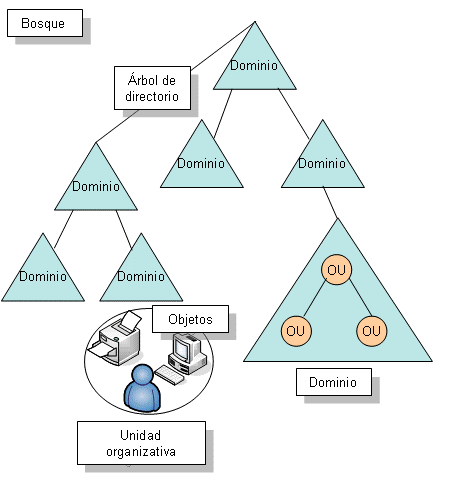

### **2.1.2 Instalación del Rol Active Directory y DNS**

* En el **Panel** seleccionamos _**Agregar Roles y Características**._
* _**Instalación Basada en Características o Roles.**_
* A estas alturas solo tenemos un servidor así que lo seleccionamos.
* En el listado de roles seleccionamos el rol: _**Servicios de Dominio Active Directory**._
* Aparece un listado de las características que necesita el rol y seleccionamos _**Agregar Características**_.
* Vuelve a aparecer un listado con todas las características que podría instalar. No necesitamos ninguna que no esté ya marcada. Después le damos a _**Instalar**_.

Después de Instalar, es necesario _**Promover el dominio**_ \(hay una notificación en la barra superior del panel\). Le damos a la **notificación** e inicia el **proceso de promoción**, lo que implica aplicar los cambios en el equipo actual y convertirlo en controlador de dominio.

* Nos da tres opciones:
  * **Agregar un controlador de dominio a un dominio existente**: Es nuestro primer servidor por lo tanto no podemos hacer esto.
  * **Agregar un nuevo dominio a un bosque existente**: No tenemos ningún árbol ahora mismo, así que no podemos hacerlo.
  * **Agregar un nuevo bosque**: Esta es la opción correcta. Genera el primer Dominio de nuestro Bosque.
* Le damos un **nombre al dominio**. P.E: laboratorio.local
* En el **nivel funcional del bosque y del dominio** hay que poner el SO más antiguo que tengamos en nuestra red.
* Podemos seleccionar qué **capacidades** tiene el controlador de dominio \(TODAS\)
* Le ponemos una **contraseña para el modo de restauración de servicios de directorio** \(DSRM\). Debe ser compleja, no hay que olvidar que el controlador de dominio almacena los datos de autenticación de todos los usuarios.
* No podemos generar una delegación de DNS por que estamos en el dominio Raíz.
* El **nombre de dominio NETBIOS** se genera automáticamente.
* Las rutas de acceso son importantes para saber donde se almacenan las cosas:
  * **Carpeta de Base de Datos**: `C:\Windows\NTDS`
  * **Carpeta de archivos de registro**: `C:\Windows\NTDS`
  * **Carpeta SYSVOL**: `C:\Windows\SYSVOL`
* En la opción de Revisar Opciones, es importante **VER SCRIPT** ya que nos permite utilizarlo como chuleta cuando no tenemos experiencia de scripting en PowerShell.
* Por último, realizará una **comprobación de los requisitos previos** y si los pasa, podremos terminar la instalación. Después, se reiniciará.

Al finalizar este proceso tendremos:

* El **servidor preparado para ser Controlador de Dominio** \(DC\).
* El **rol de Active Directory instalado**.
* El **rol DNS instalado**.
* El **dominio laboratorio.local creado**.

## **2.2 CONFIGURAR ACTIVE DIRECTORY**

### **2.2.1 Usuarios y Equipos de Active Directory**

Una vez hemos creado el directorio activo en un servidor y lo hemos promocionado a controlador de dominio, nos desaparecen los usuarios, ahora los podemos ver en _**Usuarios y Equipos de Active Directory**._

En este programa podemos gestionar todo lo relativo a Usuarios, equipos y Carpetas compartidas de la red.

* **Crear un Usuario:**

Cada usuario que se conecte a un equipo de la organización debe tener su usuario y contraseña. No es una buena practica que los usuarios compartan sus credenciales con otros usuarios que pueden no tener los mismos privilegios que ellos.

Se crea un usuario de la siguiente manera:

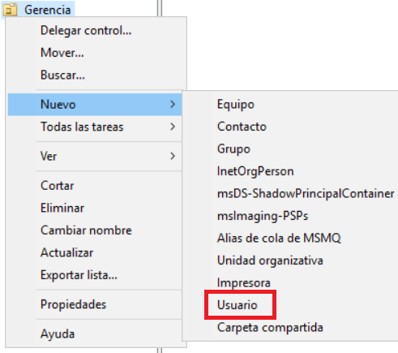

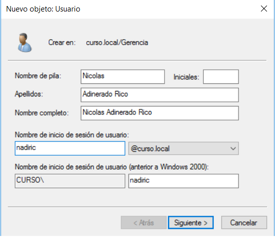

El nombre de usuario debe ser único para el dominio en el que se trabaja.

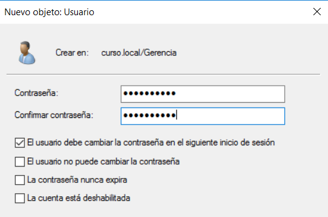


La contraseña debe incluir Mayusculas, minusculas y números. Es una buena práctica que se cambie en el primer inicio de sesión y una mala que nunca expire.

Sin embargo, en éste caso vamos a utilizar malas prácticas. Por lo tanto, marcamos a que la contraseña nunca expire y dejamos todo lo demás desmarcado.



Debe crear al menos dos usuarios con bajos privilegios.


* **Propiedades del Usuario \(Información general\):**

IZQUIERDA --&gt; Información general de contacto del Usuario.

DERECHA --&gt; Información sobre la dirección donde se aloja el Usuario.

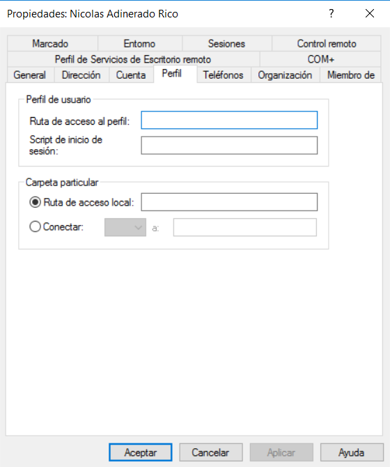

DERECHA --&gt; Aquí se consigna la ruta que permite acceder al perfil desde otra sucursal, así como el script que ese usuario ejecuta al inicio. También la ruta de su carpeta personal.

IZQUIERDA --&gt; Información de cuenta del usuario. Es una buena práctica indicar una fecha de expiración de la cuenta.

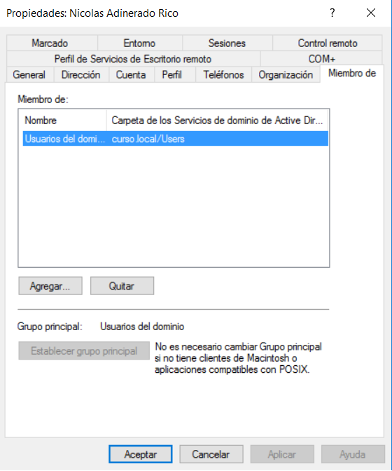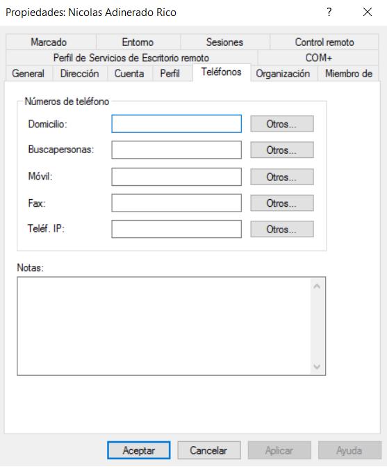

DERECHA --&gt; Información sobre los teléfonos que pertenecen al Usuario.

IZQUIERDA --&gt; Información de los grupos a los que pertenece el Usuario. Aquí se pueden añadir grupos para el usuario.

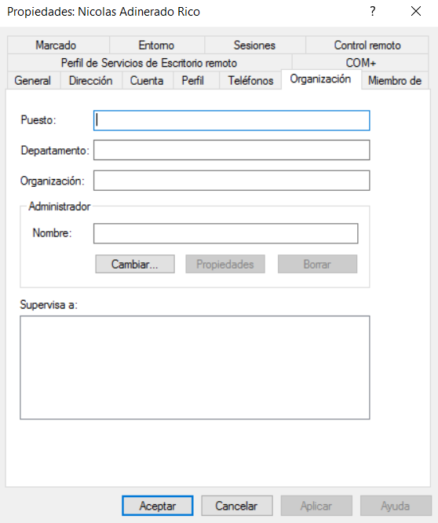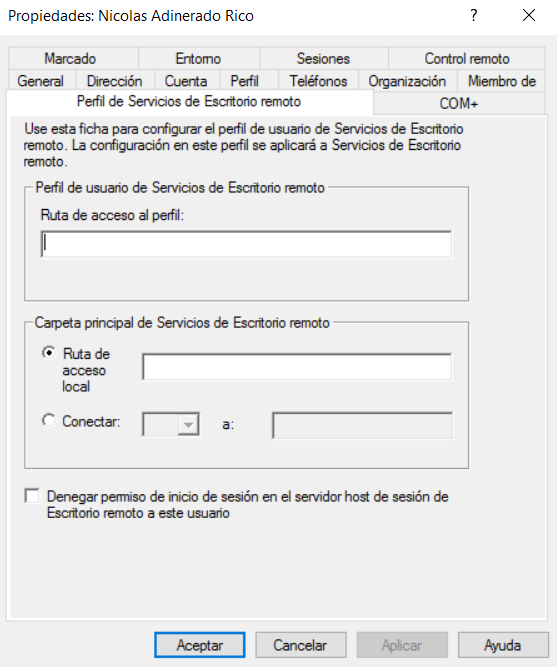

DERECHA --&gt; Información que permite al Usuario a acceder al servicio de Escritorio Remoto. \(Se verá más adelante en profundidad\)

IZQUIERDA --&gt; Información sobre el puesto que ocupa el Usuario en la organización. Se puede añadir otros usuarios que son supervisados.

DERECHA --&gt; Opciones de VoIP.

IZQUIERDA --&gt;Permite al Usuario acceder a un conjunto de particiones COM+

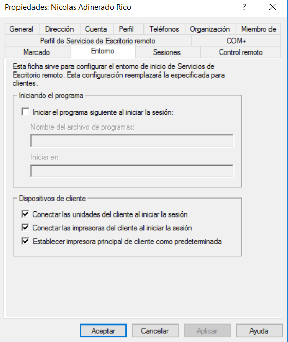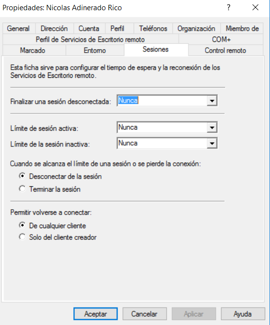

DERECHA --&gt; Configuración de Escritorio Remoto

IZQUIERDA --&gt; Configuración de Escritorio Remoto

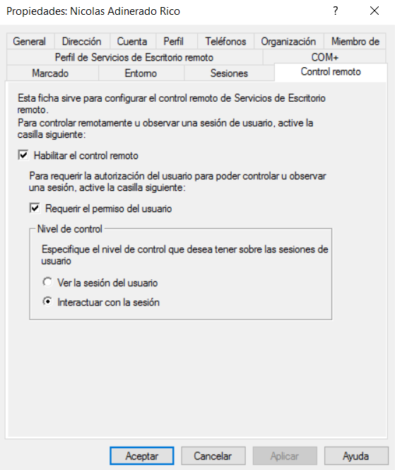

Configuración de Escritorio Remoto

* **Añadir Usuario a un Grupo \(Información general\):**

Para que los Usuarios de una Unidad Organizativa tengan los mismos privilegios entre sí, pero diferentes a los de otras Unidades Organizativas deben pertenecer al mismo grupo.

Estos grupos pueden ser de dos tipos:

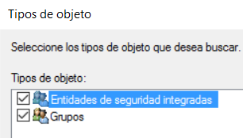

* **Entidades de Seguridad integrada**
* **Grupos**

Además de todo esto, hay que tener en cuenta que Active Directory genera grupos por defecto para estructurar mi organización.

* **Crear Unidades Organizativas \(Información genaral\):**

Las organizaciones tienen una estructura física clara y definida basada en sucursales y departamentos. Esta estructura se asemeja mucho a la estructura de la red de la organización.

Para generar esta estructura se utilizan dominios y subdominios \(para diferenciar las sucursales físicas\) y con Unidades Organizativas de Active Directory \(para diferenciar los departamentos\).

Para generar una nueva Unidad Organizativa haremos click Derecho en el dominio. Nuevo. Unidad Organizativa.

Una vez hecho esto ya podemos añadir Usuarios y Equipos a esta Unidad Organizativa. También puedo añadir una Unidad Organizativa anidada dentro de otra.

## **2.3 INICIAR SESIÓN CON UN CLIENTE EN ACTIVE DIRECTORY**


La instalación de Windows 10 Enterprise es muy sencilla y no forma parte del alcance de ésta guia. Si tiene alguna dude, utilice éste [enlace](https://www.emibin.com/virtualizar-windows-10-en-vmware-workstation-10/).


Los clientes de Active Directory deben tener instalado el **Windows 10 Enterprise** para poder conectarse correctamente al dominio. Se deben seguir los siguientes pasos:

* Asignar una **IP fija** a la maquina cliente en la misma red que la máquina servidor que alberga el dominio.

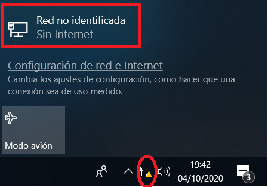

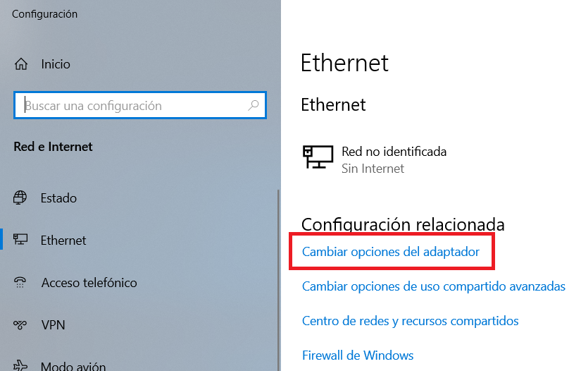

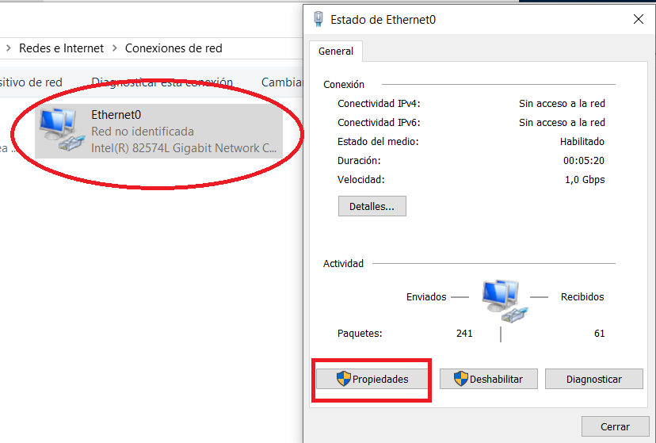

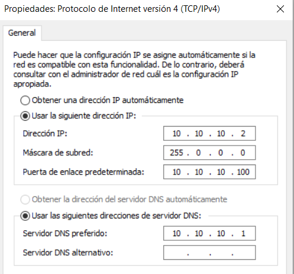


Igual que hicimos en el Controlador de dominio, el Servidor DNS preferido es la IP estática de la máquina DC-01.


* Cambiamos el nombre de nuestra maquina cliente por el que queramos. Para ello:
  * Pulsamos Pause+Windows

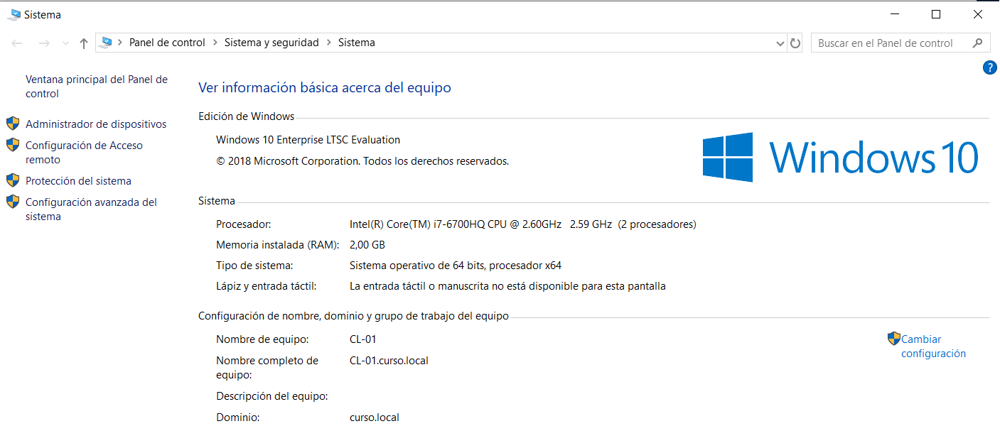

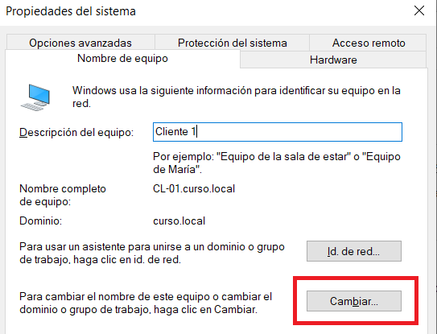

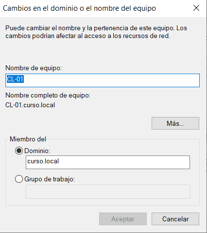


La parte inferior de la última imagen no debe cumplirse, ya que ésta última configuración se debe de hacer tras reiniciar la máquina con el nuevo nombre de equipo.

Por tanto, al llegar a la última imagen solo cambiamos el nombre de equipo y despues continuamos con la guia.


Despues de hacer todo esto reiniciamos.

* Cambiamos el dominio al que pertenece nuestra maquina cliente, haciendo los mismos pasos que para cambiar el nombre, pero cambiando el dominio al final. Tendrá que validarlo iniciando sesión como administrador del servidor. Después reiniciamos.


Para terminar de desplegar nuestro laboratorio debe crear dos máquinas Windows e iniciar sesión en el servidor en cada una de ellas con los dos usuarios con bajos privilegios que ha creado anteriormente.


