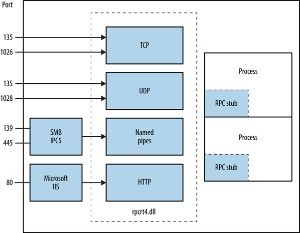

# 135, 539 - MSRPC \(traducir\)

## MSRPC PROTOCOL

Microsoft Remote Procedure Call, also known as a function call or a subroutine call, is [a protocol](http://searchmicroservices.techtarget.com/definition/Remote-Procedure-Call-RPC) that uses the client-server model in order to allow one program to request service from a program on another computer without having to understand the details of that computer's network. MSRPC was originally derived from open source software but has been developed further and copyrighted by Microsoft.

Depending on the host configuration, the RPC endpoint mapper can be accessed through **TCP and UDP port 135**, via SMB with a null or authenticated session \(TCP 139 and 445\), and as a web service listening on TCP port 593.

### **How does MSRPC work?**

[The MSRPC process begins on the client side](https://technet.microsoft.com/en-us/library/cc738291.aspx), with the client application calling a local stub procedure instead of code implementing the procedure. The client stub code retrieves the required parameters from the client address space and delivers them to the client runtime library, which then translates the parameters into a standard Network Data Representation format to transmit to the server.

The client stub then calls functions in the RPC client runtime library to send the request and parameters to the server. If the server is located remotely, the runtime library specifies an appropriate transport protocol and engine and passes the RPC to the network stack for transport to the server. From here: [https://www.extrahop.com/resources/protocols/msrpc/](https://www.extrahop.com/resources/protocols/msrpc/)

## MSRPC ENUMERATION

### **Identifying Exposed RPC Services**

You can query the RPC locator service and individual RPC endpoints to catalog interesting services running over TCP, UDP, HTTP, and SMB \(via named pipes\). Each IFID value gathered through this process denotes an RPC service \(e.g., 5a7b91f8-ff00-11d0-a9b2-00c04fb6e6fc is the Messenger interface\).

Todd Sabin's rpcdump and ifids Windows utilities query both the RPC locator and specific RPC endpoints to list IFID values. The rpcdump syntax is as follows:

`D:\rpctools> rpcdump [-p port] 192.168.189.1`

`#RESPONSE  
IfId: 5a7b91f8-ff00-11d0-a9b2-00c04fb6e6fc version 1.0  
Annotation: Messenger Service  
UUID: 00000000-0000-0000-0000-000000000000  
Binding: ncadg_ip_udp:192.168.189.1[1028]`

You can access the RPC locator service by using four protocol sequences:

 • ncacn\_ip\_tcp and ncadg\_ip\_udp \(TCP and UDP port 135\)  
 • ncacn\_np \(the \pipe\epmapper named pipe via SMB\)  
 • ncacn\_http \(RPC over HTTP via TCP port 80, 593, and others\)

